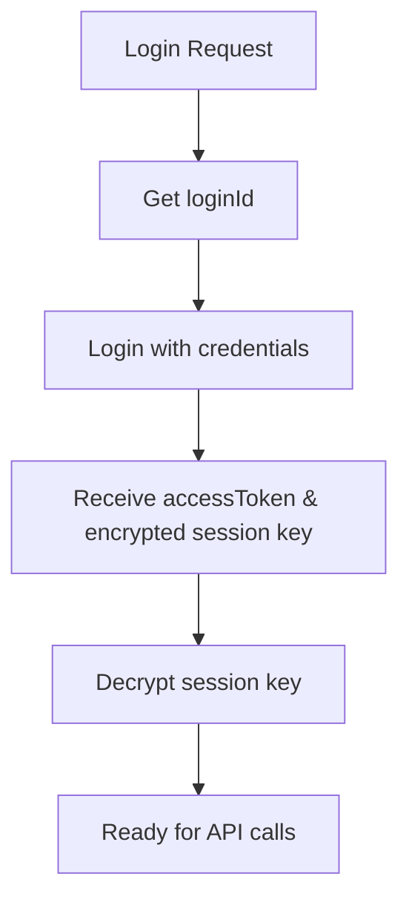

# 🏠 Midea Device Fetcher
**A powerful tool to fetch Midea cloud device Lua files and status attributes**

## ✨ Features

| Feature | Description |
|---------|-------------|
| 📱 **Device List** | Fetch complete device list from Midea cloud |
| 📥 **Lua Download** | Download device Lua protocol files automatically |
| 📊 **Status Query** | Get real-time device status attributes |
| 🖥️ **Flexible Input** | Support both command line arguments and interactive input |
| 📂 **Organized Output** | Automatically organize results in structured directories |

---

## 🚀 Quick Start

### Prerequisites

```python
    pip install requests pycryptodome
```
### Basic Usage

```python
    python all_in_one_getter.py your_msmart_account your_password
```

---

## 🔧 Technical Deep Dive

### Authentication Flow



#### Step-by-Step Authentication

| Step | API Endpoint | Description |
|------|--------------|-------------|
| 1 | `/v1/user/login/id/get` | Get login ID |
| 2 | `/mj/user/login` | Login and get encrypted session |
| 3 | - | Decrypt with fixed key `10864842703515613082` |

### Device Operations

#### 1. 📋 Device List Retrieval

```python
# API: /v1/appliance/home/list/get
Response Structure:
{
    "homeList": [{
        "roomList": [{
            "applianceList": [{
                "name": "Living Room AC",
                "type": "0xFB",
                "sn": "encrypted_sn",
                "sn8": "570667EC",
                "modelNumber": "MS-BF35A",
                "productModel": "AC120-35A"
            }]
        }]
    }]
}
```

#### 2. 🔐 SN Decryption

Decrypt device SN using AES-ECB:

| Parameter | Value |
|-----------|-------|
| **Algorithm** | AES-ECB |
| **Key** | Session key from login |
| **Padding** | PKCS7 |
| **Output** | Decrypted device SN |

#### 3. 📦 Lua File Download

```http
POST /v1/appliance/protocol/lua/luaGet
Content-Type: application/json

{
    "applianceSn": "decrypted_sn_hex",
    "applianceType": "0xFB",
    "iotAppId": 900
}
```

#### 4. 📊 Status Query

```http
POST /mjl/v1/device/status/lua/get
Content-Type: application/json

{
    "applianceSn": "sn_hex_encoded",
    "applianceType": "0xFB",
    "command": {
        "query": {}
    }
}
```

### API Reference

| Operation | Endpoint | Method |
|-----------|----------|--------|
| 🔑 Login | `?alias=/v1/user/login/id/get` | POST |
| 🔐 Authenticate | `?alias=/mj/user/login` | POST |
| 📱 Device List | `?alias=/v1/appliance/home/list/get` | POST |
| 📥 Lua Download | `?alias=/v1/appliance/protocol/lua/luaGet` | POST |
| 📊 Status Query | `?alias=/mjl/v1/device/status/lua/get` | POST |

> **Base URL**: `https://mp-prod.smartmidea.net/mas/v5/app/proxy`

#### 🔒 Request Signature

All API requests require HMAC-SHA256 signature:

```python
signature = HMAC-SHA256(
    key=hmacKey,
    message=iotKey + data + random
)
```

---

## 📁 Output Structure

```
results_your_account/
├── 📂 T0xFB_570667EC_LivingRoom_AC/
│   ├── 📜 T_xxxx.lua              # Lua protocol file
│   ├── 📊 status_attributes.json    # JSON format status
│   └── 📝 status_attributes.txt     # Human-readable status
├── 📂 T0xAC_12345678_Kitchen_Fridge/
│   ├── 📜 T_yyyy.lua
│   ├── 📊 status_attributes.json
│   └── 📝 status_attributes.txt
└── 📋 all_in_one_report.json        # Complete report
```

### Sample Output

#### JSON Status (`status_attributes.json`)
```json
{
    "power": "on",
    "temperature": 24.5,
    "mode": "cool",
    "fan_speed": "medium",
    "timestamp": "2024-01-01T12:00:00Z"
}
```

#### Text Status (`status_attributes.txt`)
```
Device: Living Room AC
Status: Online
────────────────
Power: ON
Temperature: 24.5°C
Mode: Cool
Fan Speed: Medium
Last Updated: 2024-01-01 12:00:00
```

---

## 📚 References & Credits

This project builds upon the excellent work of:

| Project | Author | Description |
|---------|--------|-------------|
| [midea_auto_cloud](https://github.com/sususweet/midea_auto_cloud) | @sususweet | Midea cloud automation |
| [midea-auto-codec](https://github.com/georgezhao2010/midea-auto-codec) | @georgezhao2010 | Midea protocol codec |

---

## ⚠️ Important Notes

- 🟢 **Only online devices** can retrieve status attributes
- 🔑 **Lua files** are downloaded using the decrypted SN
- 📡 **Internet connection** required for cloud API access
- 🔐 **Credentials** are handled locally and never stored

---
